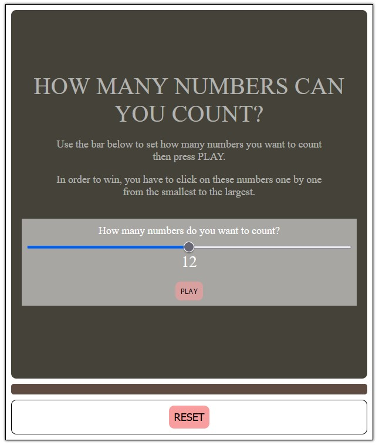

# Number Click Game

This is a small game created using vanilla JavaScript. The game's goal is simple: to win, you need to click on numbers in ascending order, from the smallest to the largest.

## Screenshot

## How to Play

1. **Set the Number of Counts**: First, specify the number of numbers you want to count by entering it in the input field.

2. **Press PLAY**: Press the "PLAY" button after setting the count to start the game.

3. **Click the Numbers**: Once the game starts, you will see numbers displayed on the screen. Click on them in ascending order, from the smallest number to the largest.

4. **Win the Game**: To win, you must click on all the numbers in the correct order. The game will let you know when you have successfully completed it.

## Demo

You can try out the game and see how it works in action by visiting the [demo here](https://codepen.io/ledminh-the-lessful/pen/oNpdJpw).

Enjoy the challenge, and have fun playing!
